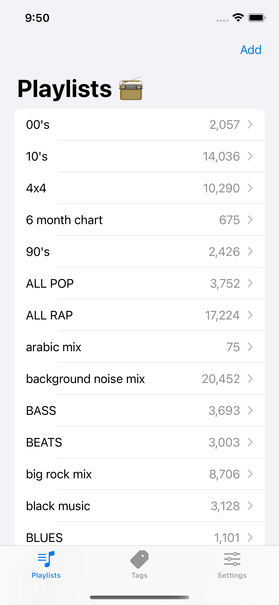
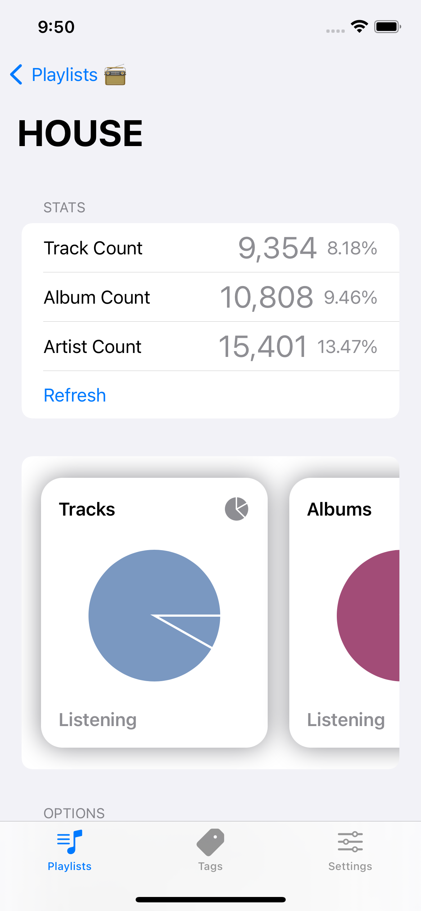
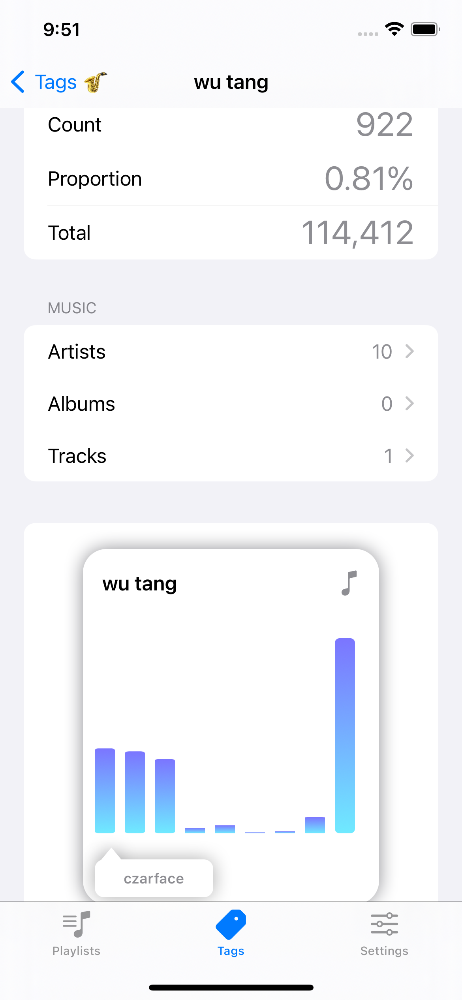

# Mixonomer iOS

iOS client for [Mixonomer](https://mixonomer.sarsoo.xyz) ([Source](https://github.com/sarsoo/Mixonomer)), using it to learn swift and SwiftUI.

Using Alamofire and SwiftyJSON for network requests.

